# Silver Platter

[https://tryhackme.com/room/silverplatter](https://tryhackme.com/room/silverplatter)


## Initial Search and Reconaissance 
This challenge is started with a nmap scan. As you can see from the screenshot, 3 open ports are discovered, including `port 22`, `port 80` and `port 8080`. 

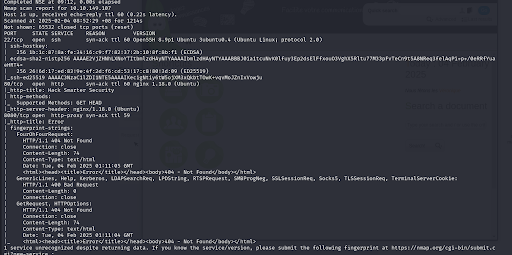

We will first look into the `http://MACHINE_IP/` website. The screenshot below indicated the main page of the organization's website. It contains 4 sections which are intro, work, about and contact. 

Contact seems interesting. Click on contact and it will link us to this page. From the screenshot, we can see the username of the manager (scr1ptkiddy) and the website's name (Silverpeas). 

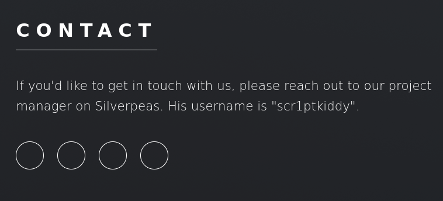

Then, try to navigate to `http://MACHINE_IP:8080`. The screenshot below shows '404 not found', meaning the URL might contain other directories. 

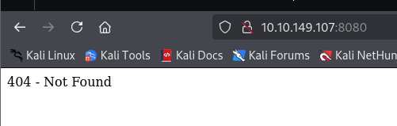

We can use gobuster to find out the directories for this website. Enter the command:

```Linux
gobuster dir -u http://MACHINE_IP:8080/ -w /usr/share/SecLists-master/Discovery/Web-Content/directory-list-2.3-medium.txt
```

 and we can see the 2 directories discovered. 

 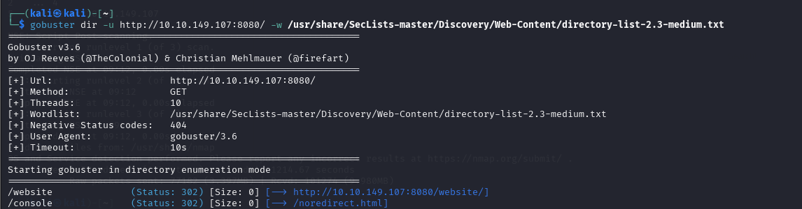

Now, try accessing these 2 directories. Based on the screenshot below, the url is forbidden, meaning that we cannot access it. 

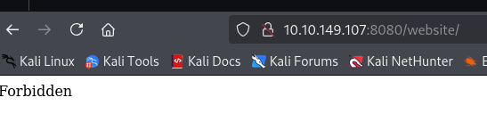

## Authentication Bypass 

However, from the contact we explored just now, we are able to know the organization's name which is 'Silverpeas'. Try adding `silverpeas` to the url. Now, we are brought to a login page under Silverpeas. The contact oage also tells us that the username of the manager is `scr1ptkiddy`, try to log in with it and a random password. As usual, login failed. 

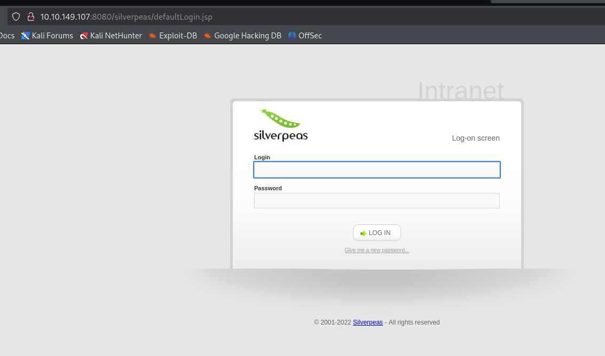

We can try to use google to search for the CVE for Silverpeas. The results show that Silverpeas before 6.3.5 have an authentication vulnerability, where it allows authentication bypass by deleting the password field. 

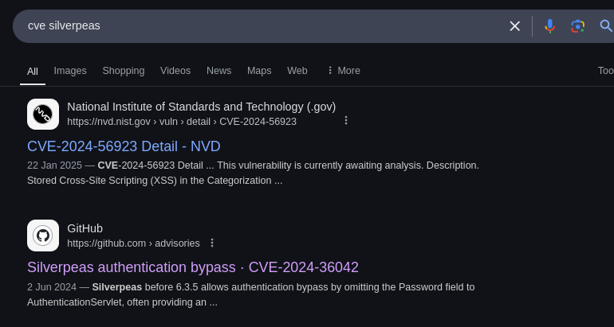

Therefore, we can make use of this vulnerability by using Burp Suite to capture the request. Send it to Repeater and delete the password field. 

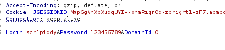
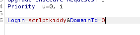
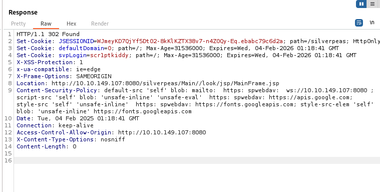

Now, we can access the website without using any credentials. 

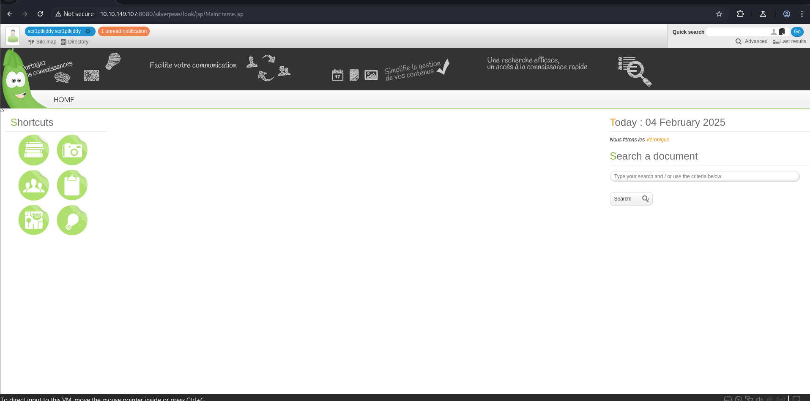

## Exploring Website & IDOR

Explore the entire website. The website has 1 unread notification. Click on it and capture the request using Burp. 

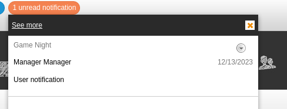
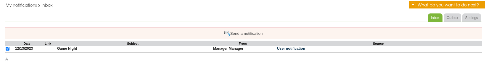

We can see that the request is `ID=5`, meaning that we can perform IDOR. Try to apply another number to see if there is any meaningful information. After trying, we found out that `ID=6` contains the SSH's username and password for Tim.

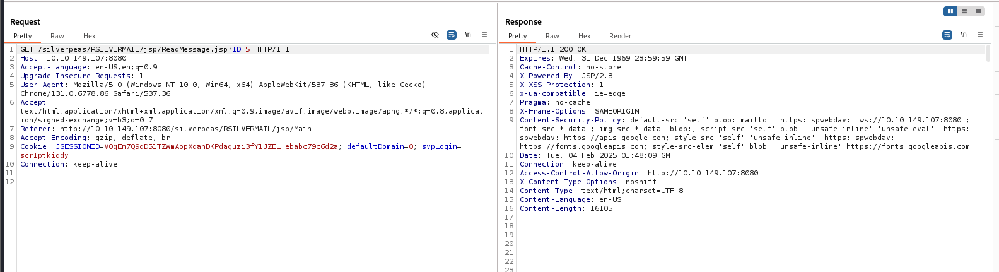
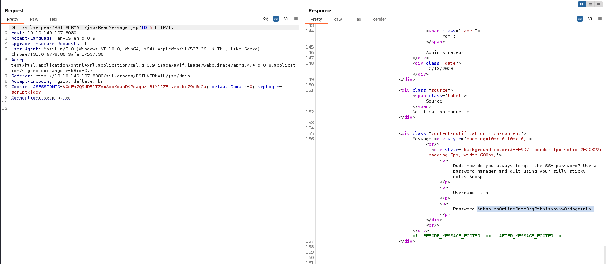

Highlight the password and look at the inspector section. Use the decoded string to ssh inside Tim's account. 

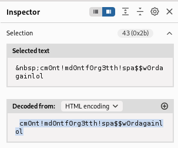

## User's Flag Extraction

We manage to access the account with the given credentials. 

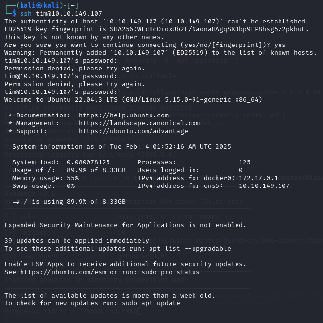

Now look at the user.txt file and we are able to see the flag now. 

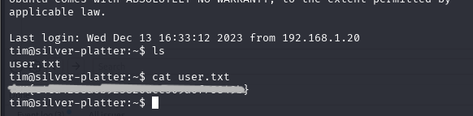

## Privilege Escalation

We can discover the credentials using another method. If we click on everything on the website, we are able to find 3 user accounts under the directory section. 

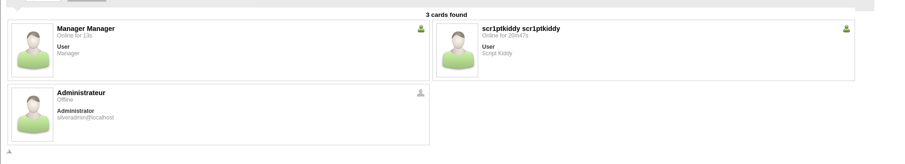

Now go back to Burp, change the username to "Manager" and without the password field. 

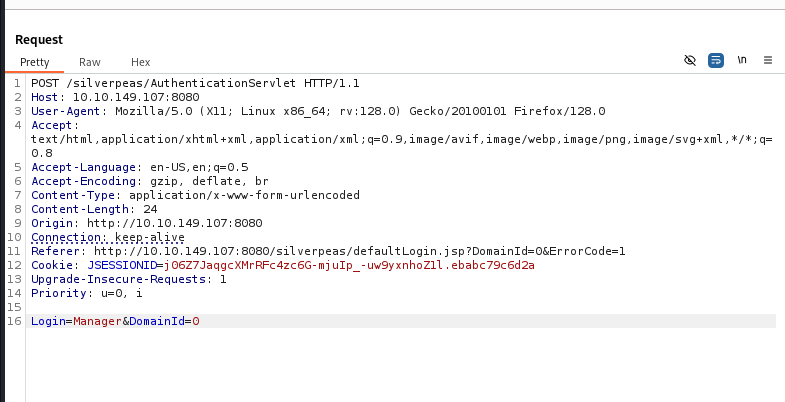

We can now log on to the manager's account. 

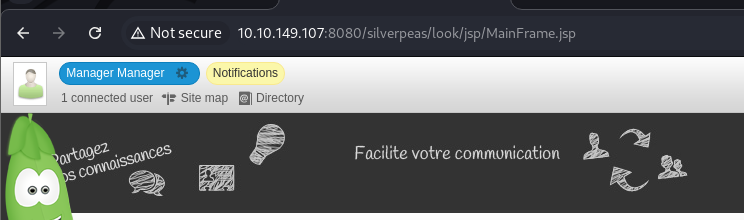

Look at the notifications. We can see the username and password there. 

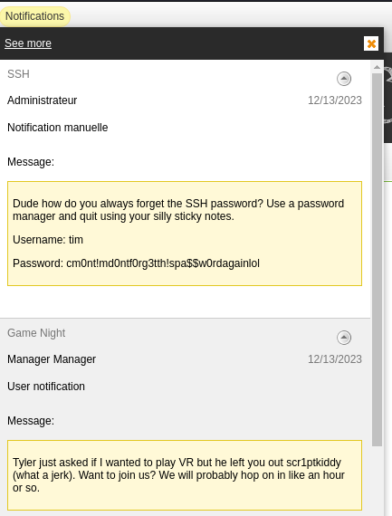

## Root's Flag Extraction

Now we need to obtain the root's flag. Use `id` to check the gorup of Tim. He is in the `adm` group, meaning that we can use `var/log/` to check for more meaningful information. Then, use `cat /etc/passwd` to see the other users. As you can see, there is another user called `tyler`. 

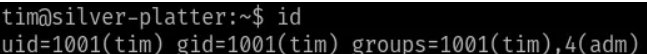
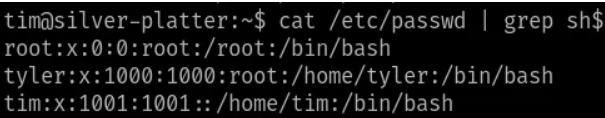

Try to look at the logs related to Tyler by using `grep -iR tyler`. We can see there are few database entries with his credentials exposed. 

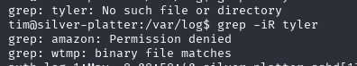
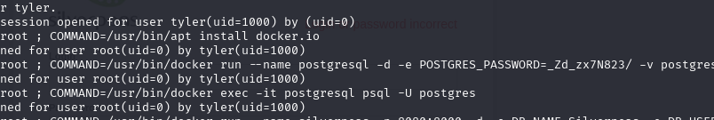

Try to use the credentials to log on to his accoutn. This user is allowed to run any root command using sudo. Try `sudo su` to change into root. Head to the root directory and we can find the flag there. 


